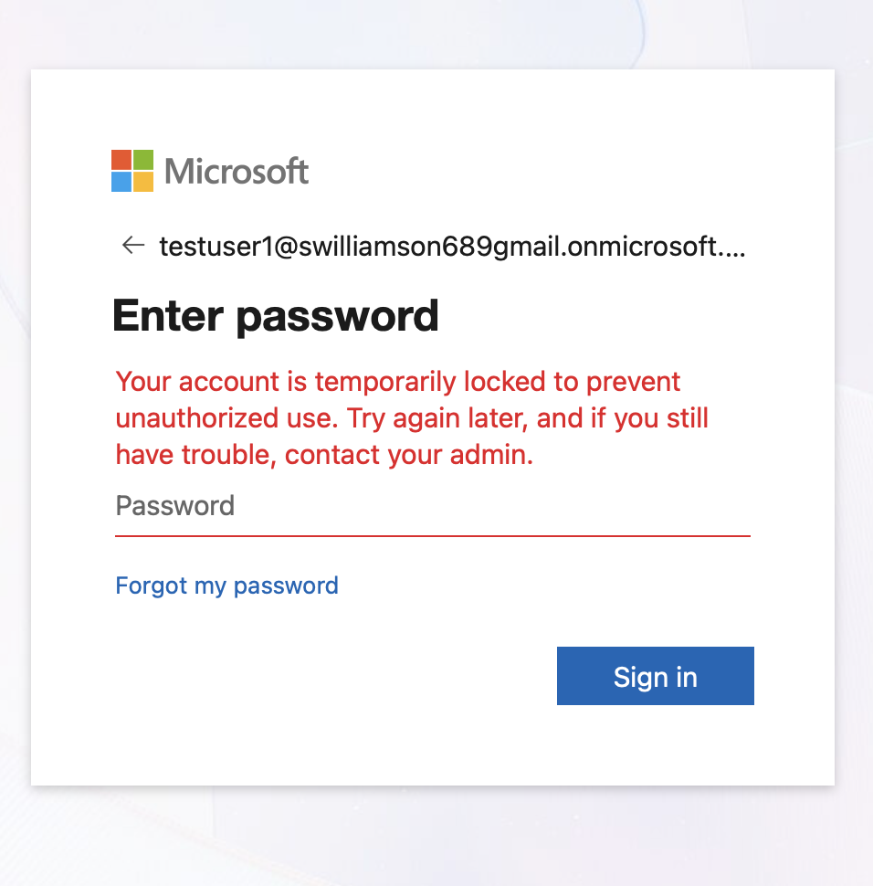
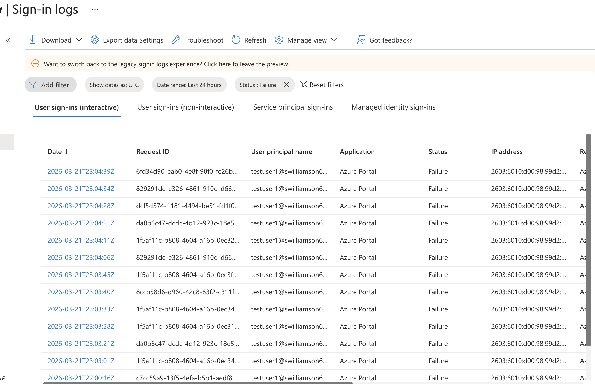
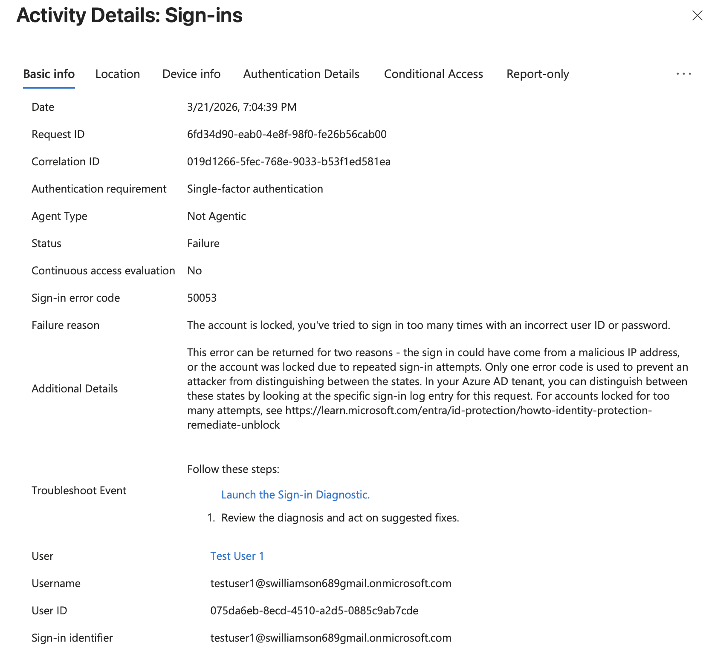
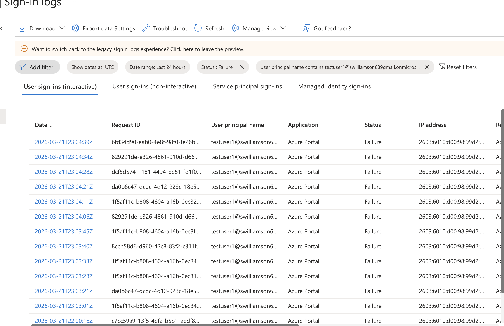
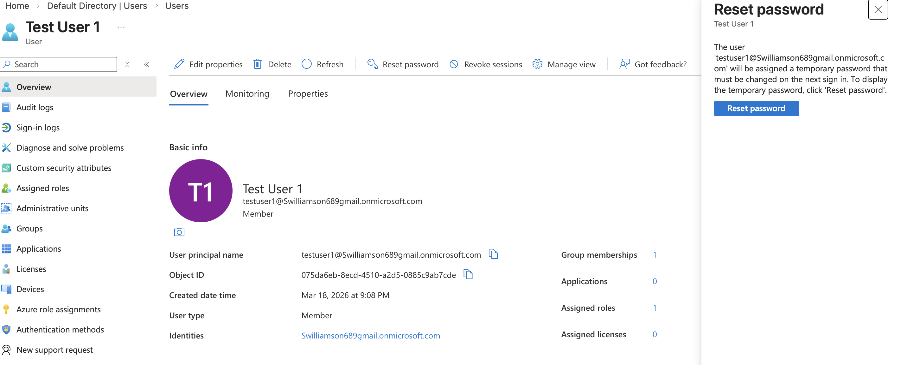

# Microsoft Entra ID – Account Lockout Investigation

## Overview

This lab demonstrates how I investigated an account lockout in a Microsoft Entra ID lab environment by reviewing sign-in logs, analyzing authentication failure details, isolating activity for the affected user, and performing a password reset as a remediation step.

The goal was to practice a structured troubleshooting process rather than immediately resetting the user's password without first identifying the cause of the authentication failure.

## Lab Environment

- Microsoft Entra ID
- Microsoft Entra admin center
- Entra sign-in logs
- Test user account: `testuser1`

## Scenario

The `testuser1` account was intentionally subjected to repeated incorrect password attempts until authentication was blocked.

The investigation focused on determining why the user could not sign in and identifying evidence of the failure within Microsoft Entra sign-in logs.

## Investigation

### 1. Identify the User-Facing Authentication Problem

After multiple incorrect password attempts, the user received a message indicating that sign-in was temporarily blocked because of repeated failed attempts.

### 2. Review Failed Sign-In Activity

I reviewed Microsoft Entra sign-in logs and filtered the results to examine failed authentication attempts.

Multiple failures associated with the affected account appeared within a short period of time.

### 3. Analyze the Failure Details

I opened an individual failed sign-in event to examine the authentication details.

The event displayed error code `50053`, providing additional information about why authentication was being blocked.

### 4. Isolate Activity for the Affected User

I filtered the sign-in activity specifically for `testuser1` so that authentication events for other users would not interfere with the investigation.

This provided a focused view of the affected user's failed sign-in activity.

## Remediation

After investigating the authentication failures, I performed a password reset for `testuser1` through Microsoft Entra ID.

The password reset is documented as the remediation action performed during the lab. A successful post-reset sign-in was not captured, so this lab does not claim that the screenshot independently verifies restored account access.

## Troubleshooting Process

**Reported problem → Review sign-in logs → Identify repeated failures → Analyze failure details → Isolate affected user → Perform remediation**

This approach helped reinforce the importance of investigating authentication problems before making account changes.

## Skills Practiced

- Microsoft Entra ID user support
- Authentication troubleshooting
- Sign-in log investigation
- Filtering authentication events
- Interpreting sign-in failure information
- User-specific activity analysis
- Password reset administration
- Troubleshooting documentation

## What I Learned

This lab reinforced that an account lockout should be investigated rather than treated only as a password-reset request.

Microsoft Entra sign-in logs can provide useful information about authentication failures, including the affected user, failure status, and additional error details. Filtering the logs to a specific user also makes it easier to separate relevant authentication activity from unrelated events.

The exercise gave me hands-on practice following a repeatable identity-support troubleshooting process: identify the problem, gather evidence, narrow the scope, review the failure details, take an appropriate remediation action, and document the result.

> **Note:** This scenario was performed in a personal Microsoft Entra ID lab for hands-on learning and does not represent professional production experience.
