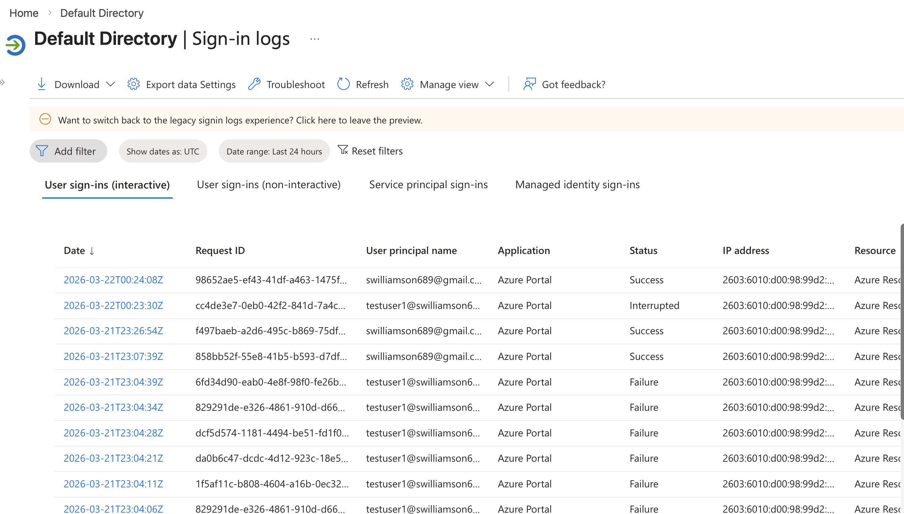
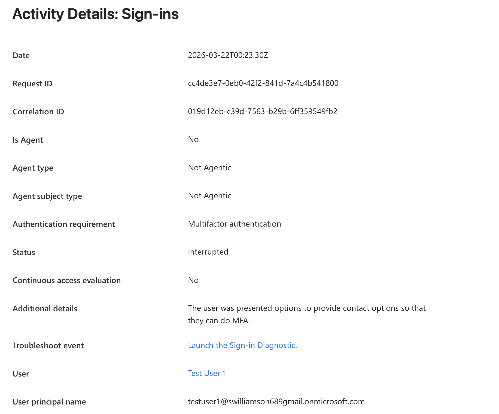
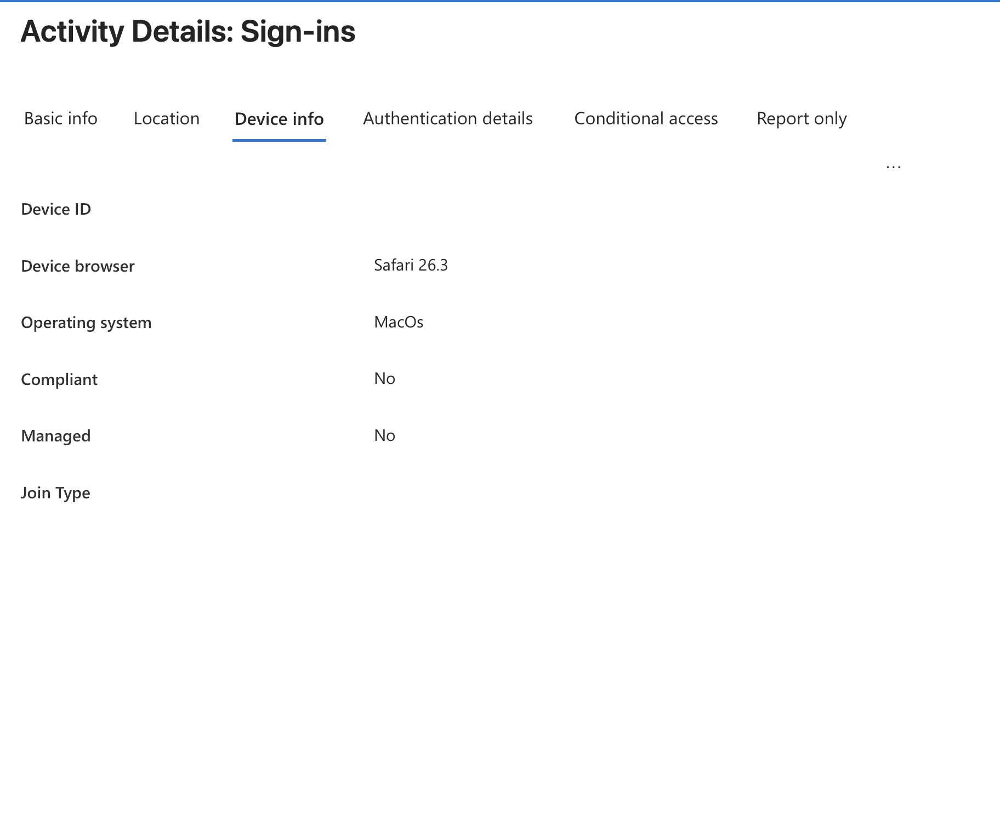
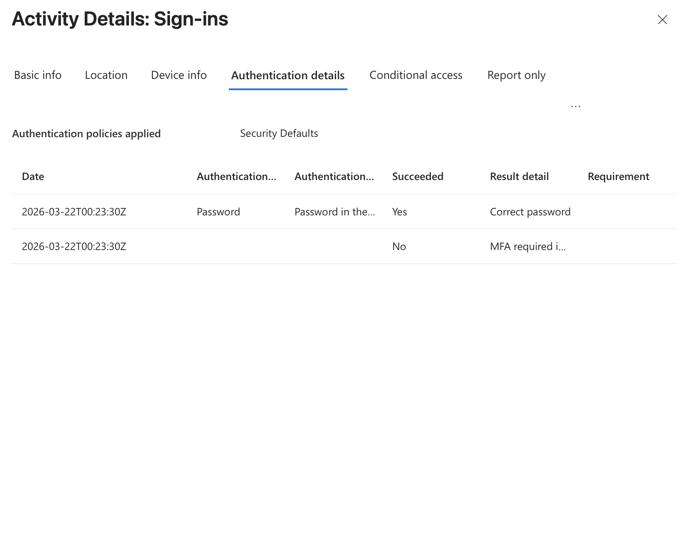
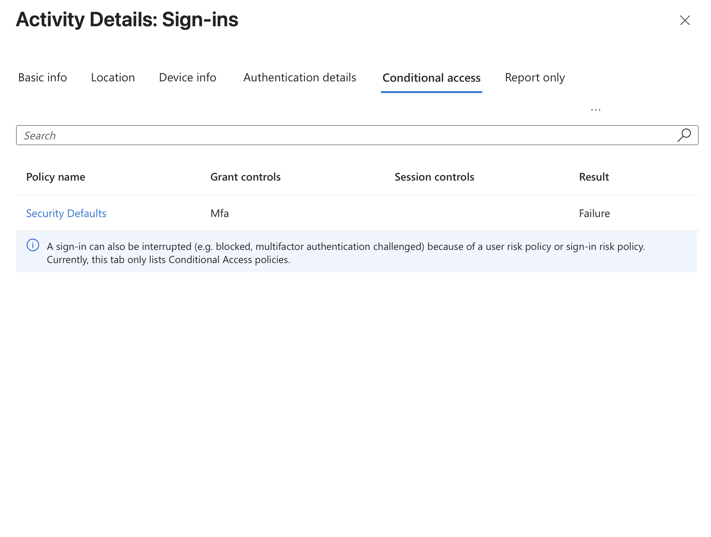

# Microsoft Entra ID – Interrupted Sign-In & MFA Investigation

## Overview

This lab demonstrates how I investigated an interrupted Microsoft Entra ID sign-in by reviewing sign-in logs and analyzing authentication, device, and access-control information associated with the event.

The goal was to determine why the authentication process did not complete successfully by following the available evidence rather than assuming the sign-in was malicious or immediately making changes to the user's account.

## Lab Environment

- Microsoft Entra ID
- Microsoft Entra admin center
- Entra sign-in logs
- Security Defaults
- Multifactor authentication (MFA)
- Test user account

## Scenario

While reviewing Microsoft Entra sign-in activity, I identified an interactive user sign-in with a status of **Interrupted**.

I opened the event and investigated the available information to determine what occurred during authentication.

## Investigation

### 1. Identify the Interrupted Sign-In

I reviewed Microsoft Entra sign-in logs and identified the event associated with the test user.

The event showed a status of **Interrupted**, which indicated that the authentication process had not completed normally.

### 2. Review the Sign-In Details

I opened the event and reviewed its basic information.

The event showed:

- Authentication requirement: **Multifactor authentication**
- Status: **Interrupted**
- Additional information indicating that the user was presented with options related to completing MFA

This established that MFA was part of the authentication flow and provided a direction for further investigation.

### 3. Review Device Context

I examined the device information associated with the sign-in.

The event showed:

- Browser: **Safari**
- Operating system: **macOS**
- Managed: **No**
- Compliant: **No**

I treated this information as additional context for the investigation rather than assuming that the device's management or compliance state caused the interrupted authentication.

### 4. Analyze Authentication Details

I reviewed the authentication details to determine which portion of the authentication process succeeded and where it stopped.

The event showed that the password authentication succeeded and reported a **Correct password** result.

A subsequent authentication step showed **Succeeded: No** with result information indicating that MFA was required.

This provided the strongest evidence that the password itself was not the problem and that the authentication process was interrupted during the MFA portion of the sign-in.

### 5. Review Access-Control Information

I reviewed the **Conditional access** tab associated with the sign-in event.

The event displayed:

- Policy name: **Security Defaults**
- Grant controls: **MFA**
- Result: **Failure**

I documented Security Defaults as the authentication policy information shown for this event rather than describing it as a custom Conditional Access policy.

## Additional Investigation

I also reviewed the location and IP information associated with the sign-in as additional context.

The available evidence did not establish the location as the cause of the interrupted authentication, so I did not treat geographic information alone as evidence of suspicious activity.

## Findings

The investigation showed that:

- The sign-in status was **Interrupted**
- Multifactor authentication was required
- The user's password authentication succeeded
- The MFA portion of authentication did not complete successfully
- Security Defaults was shown as the authentication policy applied to the event
- Device information showed a macOS/Safari device that was unmanaged and noncompliant

Based on the available evidence, the interrupted sign-in was associated with the incomplete MFA portion of the authentication flow.

The evidence collected in this lab did **not** establish that the sign-in attempt was malicious.

## Troubleshooting Process

**Identify event → Review basic information → Examine device and location context → Analyze authentication details → Review access-control information → Determine where authentication stopped**

This process reinforced the importance of examining multiple pieces of sign-in data before determining why authentication failed.

## Skills Practiced

- Microsoft Entra ID authentication troubleshooting
- Sign-in log investigation
- Multifactor authentication analysis
- Authentication event interpretation
- Device-context analysis
- Security Defaults investigation
- Identity troubleshooting
- Evidence-based technical documentation

## What I Learned

This lab reinforced that an interrupted or failed sign-in should not automatically be treated as a bad password or suspicious activity.

Microsoft Entra sign-in logs provide multiple sources of information that can help isolate an authentication problem, including the overall sign-in status, authentication steps, device information, location information, and access-control results.

In this scenario, reviewing the authentication details was especially important because it showed that the password had succeeded while the MFA portion of authentication had not completed successfully.

The exercise gave me hands-on practice following the evidence through an authentication flow and separating useful investigation context from the information that actually explained the sign-in problem.

> **Note:** This scenario was performed in a personal Microsoft Entra ID lab for hands-on learning and does not represent professional production experience.
