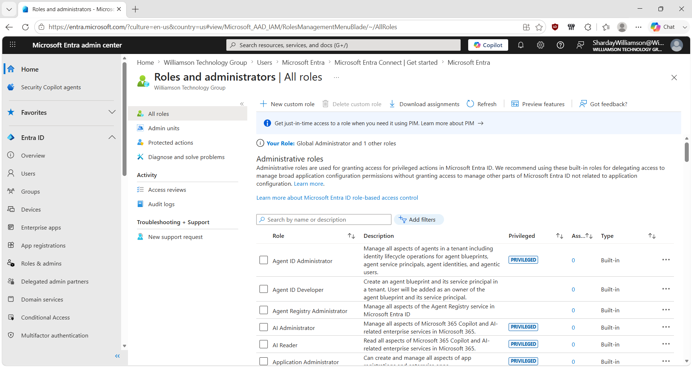
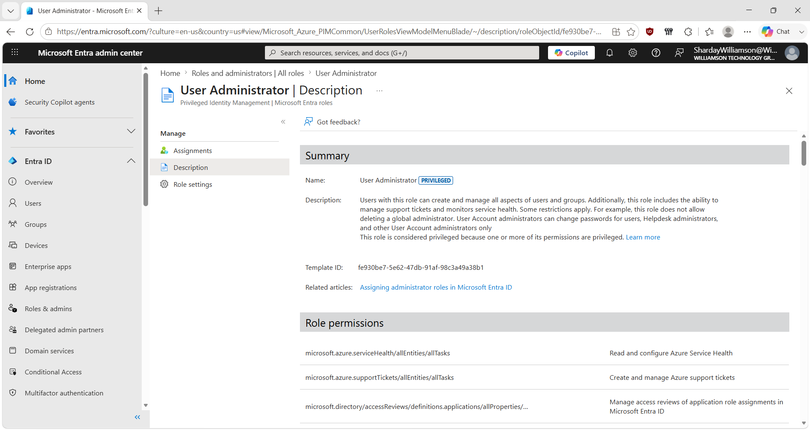
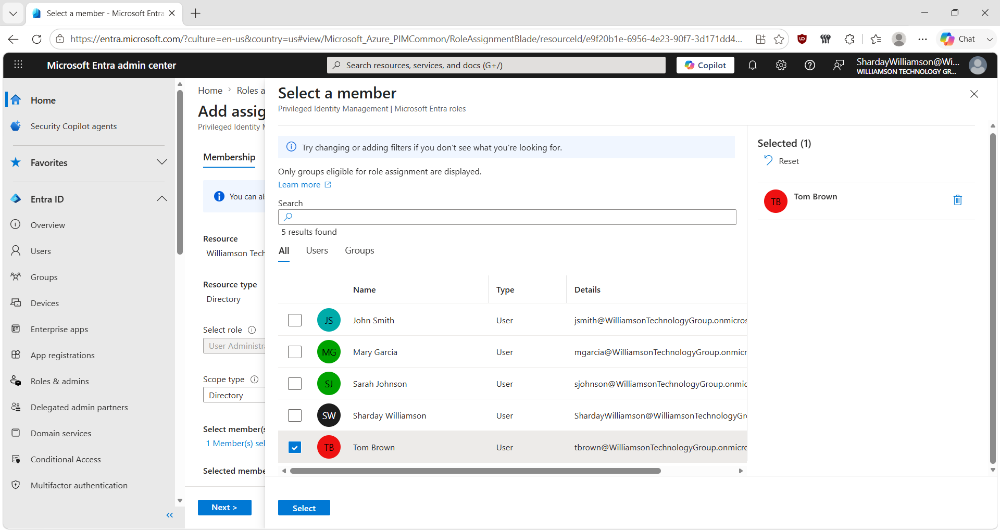
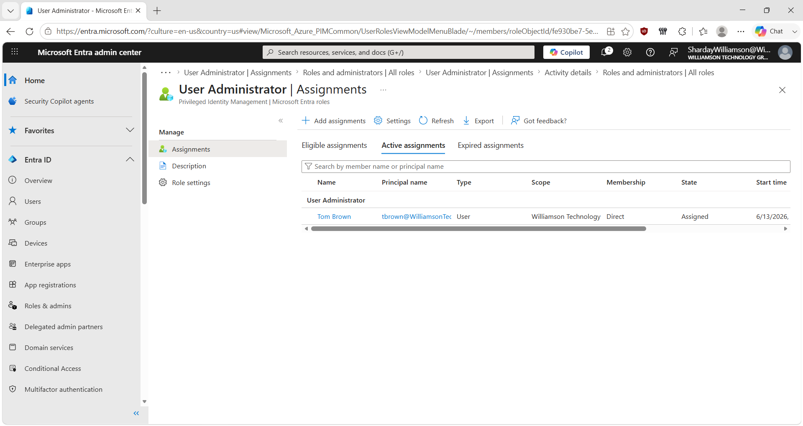

# Microsoft Entra ID – Administrative Roles & RBAC

## Overview

This lab demonstrates how I used Microsoft Entra ID administrative roles to delegate privileged access in a personal cloud lab environment.

I reviewed the available administrative roles, examined the User Administrator role and its permissions, selected a user for the role assignment through Microsoft Entra Privileged Identity Management (PIM), and verified the resulting active assignment.

The goal was to practice assigning administrative access without relying on unrestricted tenant-wide administrator privileges.

## Lab Environment

- Microsoft Entra ID
- Microsoft Entra admin center
- Microsoft Entra administrative roles
- Privileged Identity Management (PIM)
- Test tenant: Williamson Technology Group
- Test user: Tom Brown

## Scenario

A user in the lab environment needed delegated administrative capabilities for user management.

Rather than assigning unrestricted administrative access, I reviewed the available Microsoft Entra roles and selected the **User Administrator** role for the exercise.

## Role Assignment Process

### 1. Review Microsoft Entra Administrative Roles

I navigated to **Roles and administrators** and reviewed the built-in administrative roles available in Microsoft Entra ID.

These roles provide different sets of administrative permissions and can be used to delegate administrative responsibilities based on what a user needs to manage.

### 2. Examine the User Administrator Role

I opened the **User Administrator** role and reviewed its description and permissions before making an assignment.

Microsoft Entra identifies User Administrator as a privileged role. The role provides delegated capabilities for managing users and groups while also having restrictions on certain administrative actions.

Reviewing the role before assigning it helped reinforce the importance of understanding what permissions an administrative role provides rather than selecting a role based only on its name.

### 3. Select the User for the Role Assignment

Using the Microsoft Entra role-assignment workflow in PIM, I selected **Tom Brown** as the member for the User Administrator assignment.

The assignment was configured at the **Directory** scope.

### 4. Verify the Active Assignment

After completing the assignment, I returned to the User Administrator role and reviewed its assignments.

Tom Brown appeared under **Active assignments** with:

- Type: **User**
- Membership: **Direct**
- State: **Assigned**

This verified the final state of the role assignment in the lab.

## RBAC and PIM

This lab helped me distinguish between two related identity-management concepts.

### Role-Based Access Control (RBAC)

RBAC determines **what administrative permissions a role provides**.

In this scenario, the User Administrator role defined the administrative capabilities being delegated to the user.

### Privileged Identity Management (PIM)

PIM provides additional controls for managing privileged role assignments.

The role-assignment workflow used in this lab was performed through Microsoft Entra PIM, and the completed User Administrator assignment was verified under **Active assignments**.

The screenshots captured in this lab verify the final active assignment. They do not independently document an earlier eligible assignment, so this project does not claim that the role was converted from Eligible to Active.

## Least-Privilege Principle

An important concept reinforced by this lab was **least privilege**.

Administrative users should receive permissions appropriate to the responsibilities they need to perform rather than automatically receiving unrestricted administrative access.

Using specialized Microsoft Entra roles provides a way to delegate administrative responsibilities more precisely than relying on highly privileged roles for routine administration.

## Skills Practiced

- Microsoft Entra ID administration
- Administrative role management
- Role-Based Access Control (RBAC)
- Privileged Identity Management (PIM)
- User Administrator role assignment
- Directory-scoped role assignment
- Privileged access verification
- Least-privilege concepts
- Identity and Access Management (IAM)
- Technical documentation

## What I Learned

This lab reinforced that assigning administrative access involves more than simply making someone an administrator.

I first reviewed the available administrative roles, examined the permissions associated with the User Administrator role, selected the appropriate test user, completed the role assignment, and then verified its final state.

The exercise also helped me better distinguish **RBAC from PIM**: RBAC defines the permissions associated with an administrative role, while PIM provides additional controls for managing privileged role assignments.

This gave me hands-on practice with a structured administrative-access workflow:

**Review roles → Understand permissions → Select user → Assign role → Verify assignment**

> **Note:** This scenario was performed in a personal Microsoft Entra ID lab for hands-on learning and does not represent professional production experience.
