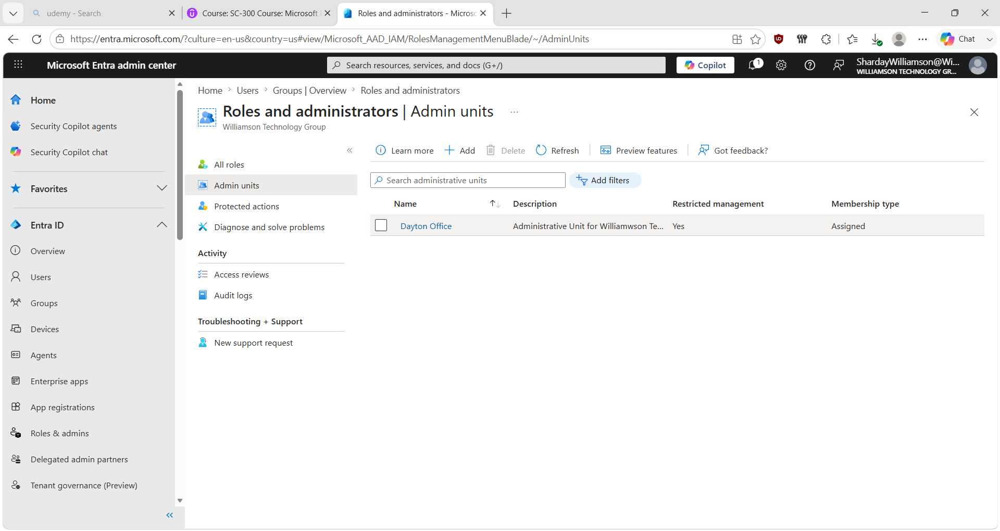
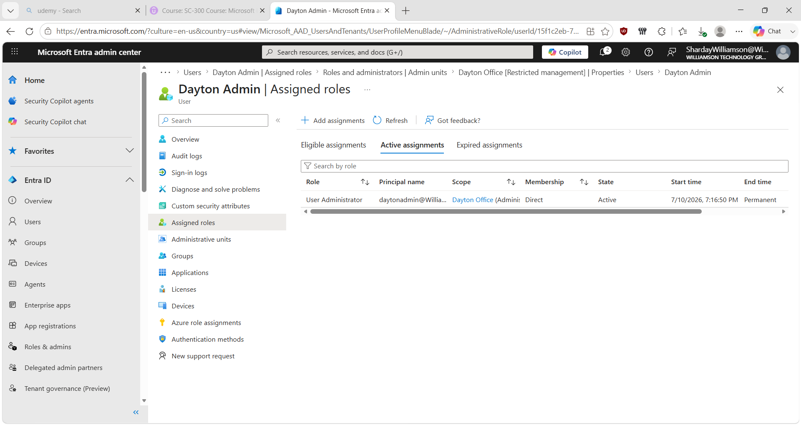
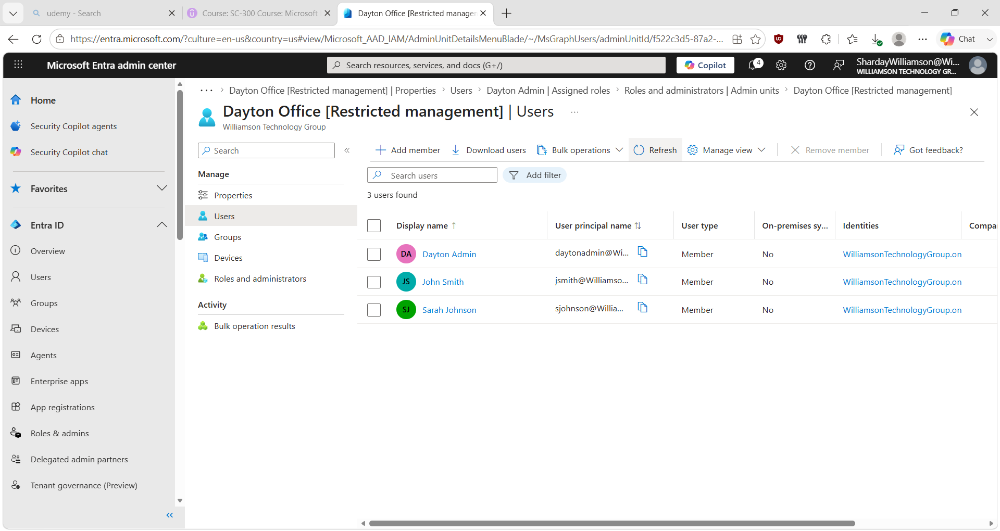
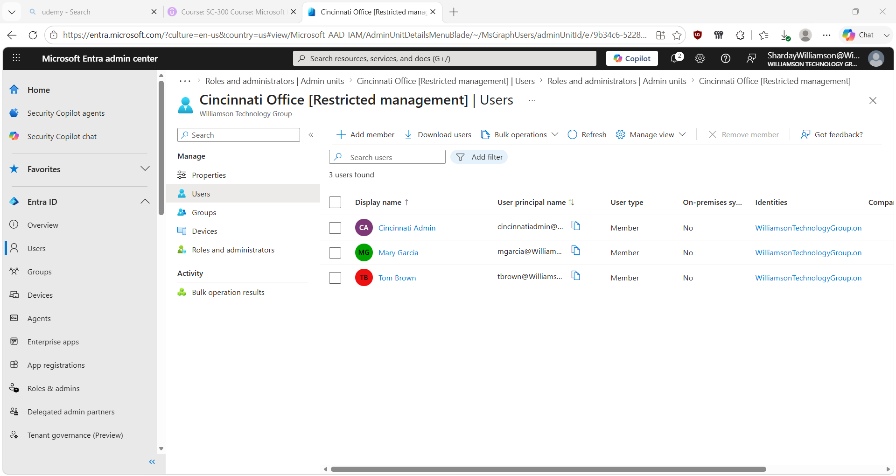

# Microsoft Entra Administrative Units & Delegated Administration

## Overview

This lab demonstrates how I configured Microsoft Entra Administrative Units to practice delegated identity administration in a cloud lab environment.

I created separate Administrative Units for the Dayton and Cincinnati offices, organized users by location, and assigned dedicated administrators the User Administrator role scoped to their respective Administrative Units.

The goal was to practice limiting administrative scope rather than providing unnecessary tenant-wide administrative access.

> **Note:** This is a personal hands-on lab created for learning and skill development. It does not represent professional production experience.

## Environment

- Microsoft Entra ID
- Williamson Technology Group lab tenant
- Dayton Office Administrative Unit
- Cincinnati Office Administrative Unit
- User Administrator role
- Restricted Management

## Scenario

Williamson Technology Group has employees located in Dayton and Cincinnati.

Rather than giving local administrators administrative authority across the entire tenant, I created separate Administrative Units for each office and configured scoped administrative role assignments.

This created the following structure:

**Dayton Office**
- Dayton Admin — User Administrator scoped to the Dayton Office AU
- John Smith — AU member
- Sarah Johnson — AU member

**Cincinnati Office**
- Cincinnati Admin — User Administrator scoped to the Cincinnati Office AU
- Mary Garcia — AU member
- Tom Brown — AU member

## 1. Create the Dayton Administrative Unit

I created the Dayton Office Administrative Unit and enabled Restricted Management.

This established an administrative boundary for the Dayton office users.

## 2. Assign Scoped Administrative Access

I assigned Dayton Admin the User Administrator role with the assignment scoped to the Dayton Office Administrative Unit.

This allowed me to practice delegated administration without assigning the role across the entire tenant.

## 3. Add Dayton Office Members

I added the appropriate users to the Dayton Office Administrative Unit.

Administrative Unit membership determines which objects fall within the administrative scope. Membership itself does not grant administrative permissions; the scoped role assignment determines what administrative actions the delegated administrator can perform.

## 4. Configure Delegated Administration for Cincinnati

I repeated the delegated administration model for the Cincinnati office by creating a separate Administrative Unit and assigning Cincinnati Admin the User Administrator role scoped to that AU.

## 5. Add Cincinnati Office Members

I added the Cincinnati users to their appropriate Administrative Unit, creating separate administrative scopes for the two office locations.

## Key Concepts Practiced

- Microsoft Entra Administrative Units
- Delegated administration
- Scoped administrative role assignments
- User Administrator role
- Administrative Unit membership
- Restricted Management
- Least-privilege administration
- Organizing identities by administrative scope

## What I Learned

This lab helped me understand the difference between organizing identities and granting administrative permissions.

Administrative Unit membership defines which objects are included within an administrative scope, while the scoped role assignment determines what an administrator is authorized to manage.

I also practiced using scoped administrative roles as an alternative to providing broader tenant-wide administrative access.
