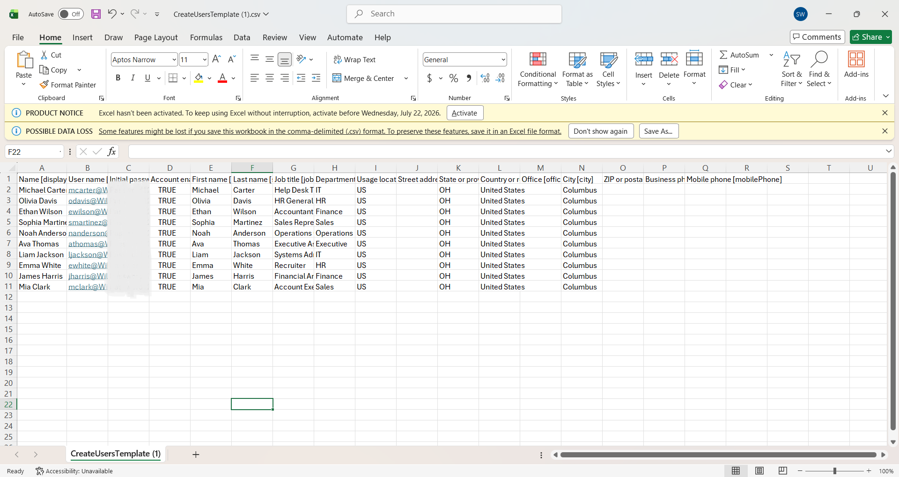
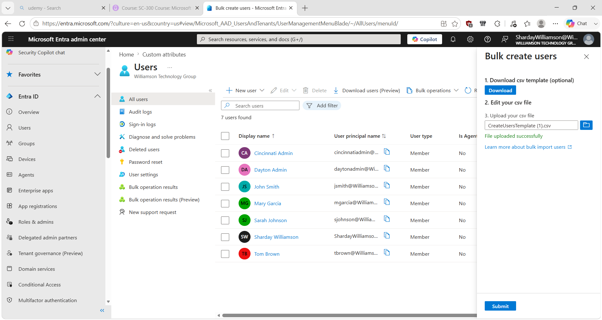
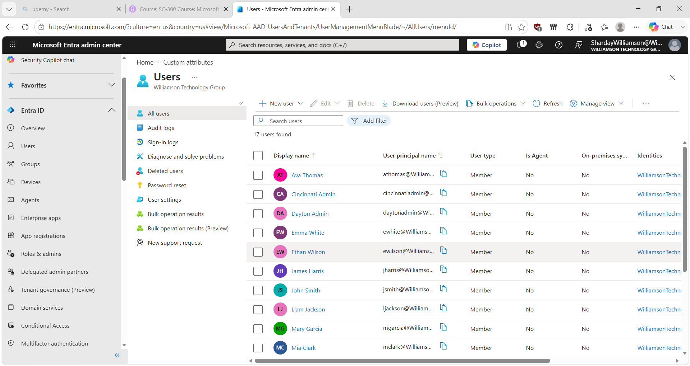

# Microsoft Entra ID – Bulk User Provisioning with CSV

## Overview

This lab demonstrates how I used Microsoft Entra ID's bulk user creation workflow to provision multiple test user accounts from a CSV file in a personal cloud lab environment.

Instead of manually creating each account individually, I prepared a CSV containing ten test users, uploaded the file through the Microsoft Entra admin center, and verified that the new accounts appeared in the directory.

The goal was to practice a more efficient approach to provisioning multiple identities while maintaining consistent user attributes.

## Lab Environment

- Microsoft Entra ID
- Microsoft Entra admin center
- Microsoft Excel
- CSV bulk user creation template
- Test tenant: Williamson Technology Group

## Scenario

The lab environment needed ten additional test user accounts representing employees across several departments.

Creating each account manually would require repeating the same user-creation process multiple times. I used Microsoft Entra's **Bulk create** functionality to prepare and provision the accounts together using a CSV file.

## Bulk Provisioning Process

### 1. Prepare the CSV File

I populated the Microsoft Entra bulk-create CSV template with ten test user accounts.

The file included identity and organizational attributes such as:

- Display name
- User principal name (UPN)
- Initial password
- Account enabled status
- First and last name
- Job title
- Department
- Usage location
- State
- Country
- City

I also verified that the user principal names followed the tenant's domain format before preparing the file for import.

For the public portfolio screenshot below, the initial password values have been intentionally redacted.

### 2. Upload the CSV to Microsoft Entra

I navigated to the bulk user creation workflow in the Microsoft Entra admin center and uploaded the completed CSV.

Microsoft Entra confirmed that the file was uploaded successfully and was ready for the next step in the bulk creation process.

### 3. Verify the Provisioned Users

After completing the bulk creation process, I returned to the Microsoft Entra user directory to verify the results.

Before the import, the directory displayed **7 users**. After the bulk operation, it displayed **17 users**, and the newly prepared test identities were visible in the directory.

This provided verification that the ten additional accounts had been added.

## Why Use Bulk Provisioning?

Creating multiple accounts individually can become repetitive and increase the opportunity for inconsistent data entry.

A structured CSV allows identity information for multiple users to be prepared before provisioning and then processed through a single bulk operation.

This lab simulated a common identity-administration task where multiple accounts need to be provisioned efficiently and consistently.

## Skills Practiced

- Microsoft Entra ID administration
- Bulk user provisioning
- CSV template preparation
- User Principal Name (UPN) formatting
- User attribute configuration
- Bulk user creation
- Identity provisioning
- Account verification
- IAM fundamentals
- Technical documentation

## What I Learned

This lab reinforced the difference between creating identities individually and using a structured bulk provisioning process.

I practiced preparing identity data in the required CSV format, maintaining consistent attributes across multiple users, uploading the file through Microsoft Entra, and verifying the resulting accounts in the directory.

The workflow can be summarized as:

**Prepare identity data → Validate formatting → Upload CSV → Complete bulk creation → Verify accounts**

It also reinforced an important documentation and security practice: credentials used during account provisioning should not be exposed in screenshots or public technical documentation.

> **Note:** This scenario was performed in a personal Microsoft Entra ID lab for hands-on learning and does not represent professional production experience.
